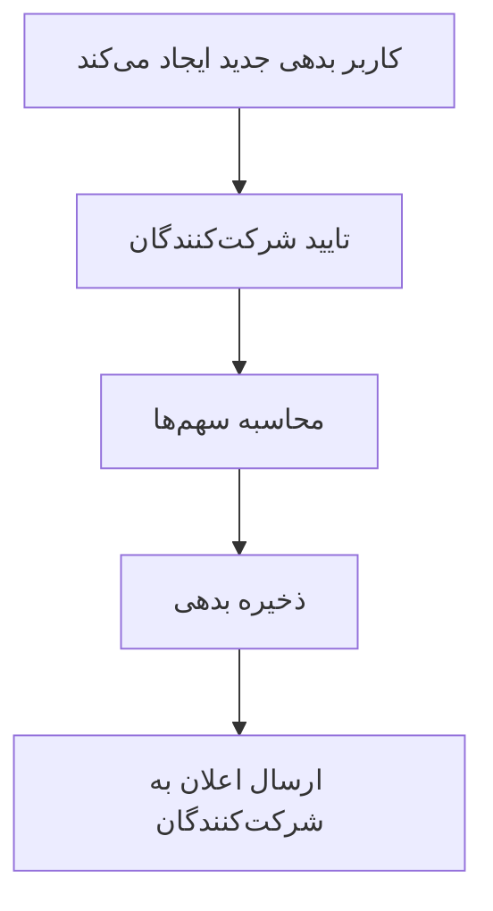
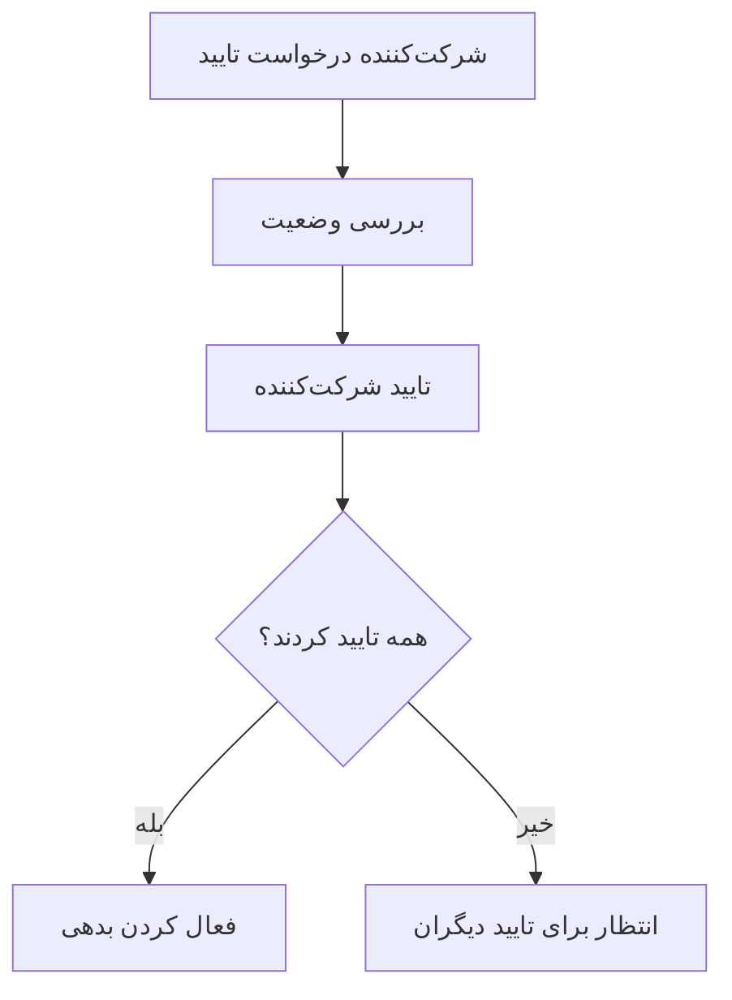
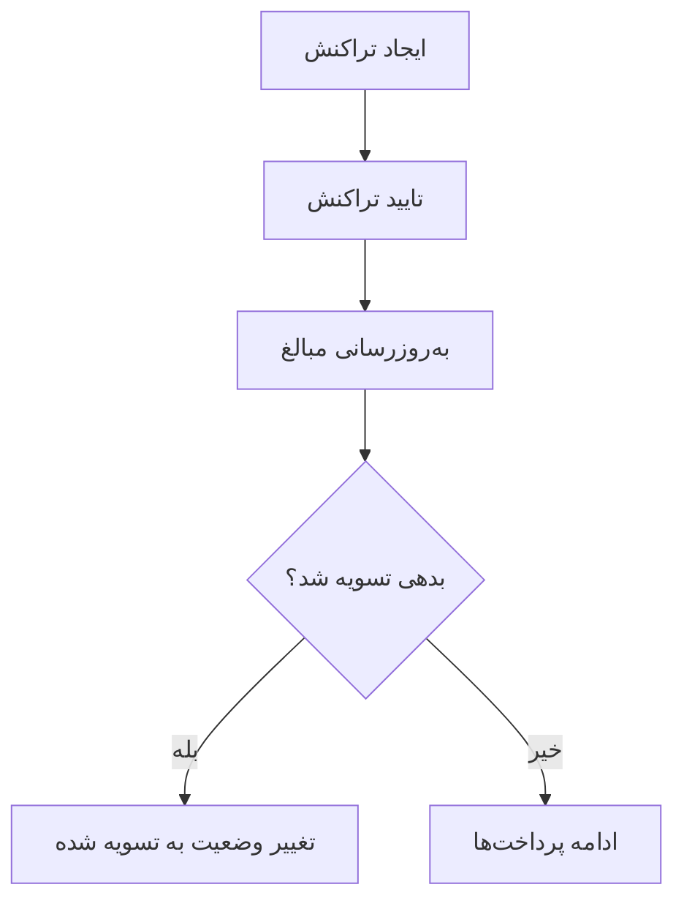

# ماژول مدیریت بدهی‌ها (Debts Module)

## 🎯 هدف
ماژول مدیریت بدهی‌ها برای مدیریت کامل بدهی‌ها، شرکت‌کنندگان و تراکنش‌ها طراحی شده است.

## 🏗️ معماری

### Entities

#### 1. Debt (بدهی)
- **هدف**: نگهداری اطلاعات اصلی بدهی
- **فیلدهای کلیدی**:
  - `title`: عنوان بدهی
  - `totalAmount`: مبلغ کل
  - `type`: نوع بدهی (گروهی، شخصی، خرید مشترک)
  - `status`: وضعیت (در انتظار، فعال، تسویه شده)
  - `creatorId`: شناسه ایجادکننده
  - `participants`: لیست شرکت‌کنندگان
  - `transactions`: لیست تراکنش‌ها

#### 2. DebtParticipant (شرکت‌کننده)
- **هدف**: مدیریت شرکت‌کنندگان در بدهی
- **فیلدهای کلیدی**:
  - `userId`: شناسه کاربر
  - `role`: نقش (بدهکار، طلبکار، شاهد)
  - `shareAmount`: مبلغ سهم
  - `paidAmount`: مبلغ پرداخت شده
  - `isConfirmed`: وضعیت تایید

#### 3. DebtTransaction (تراکنش)
- **هدف**: ثبت تراکنش‌های مالی
- **فیلدهای کلیدی**:
  - `payerId`: شناسه پرداخت‌کننده
  - `payeeId`: شناسه گیرنده
  - `amount`: مبلغ تراکنش
  - `status`: وضعیت تراکنش
  - `type`: نوع تراکنش

## 🔄 جریان کاری

### 1. ایجاد بدهی


### 2. تایید شرکت‌کنندگی


### 3. پرداخت


## 📊 API Endpoints

### بدهی‌ها
- `POST /api/v1/debts` - ایجاد بدهی جدید
- `GET /api/v1/debts` - دریافت لیست بدهی‌ها
- `GET /api/v1/debts/:id` - دریافت جزئیات بدهی
- `PUT /api/v1/debts/:id` - ویرایش بدهی
- `DELETE /api/v1/debts/:id` - حذف بدهی
- `POST /api/v1/debts/:id/confirm` - تایید شرکت‌کنندگی

### تراکنش‌ها
- `POST /api/v1/debts/transactions` - ایجاد تراکنش
- `PUT /api/v1/debts/transactions/:id/complete` - تکمیل تراکنش
- `GET /api/v1/debts/transactions` - دریافت لیست تراکنش‌ها

### آمار
- `GET /api/v1/debts/statistics` - دریافت آمار بدهی‌ها

## 🔐 امنیت

### مجوزها
- فقط شرکت‌کنندگان می‌توانند بدهی را مشاهده کنند
- فقط ایجادکننده می‌تواند بدهی را ویرایش/حذف کند
- فقط پرداخت‌کننده می‌تواند تراکنش را تکمیل کند

### اعتبارسنجی
- مجموع سهم‌ها باید با مبلغ کل برابر باشد
- ایجادکننده باید در لیست شرکت‌کنندگان باشد
- مبلغ تراکنش باید مثبت باشد

## 📈 ویژگی‌های پیشرفته

### 1. محاسبه خودکار
- مبلغ باقی‌مانده
- درصد پرداخت
- وضعیت تسویه

### 2. پشتیبانی از انواع مختلف
- بدهی گروهی
- وام شخصی
- خرید مشترک

### 3. مدیریت وضعیت
- در انتظار تایید
- فعال
- تسویه شده
- لغو شده

## 🚀 استفاده

### مثال ایجاد بدهی
```typescript
const newDebt = {
  title: "خرید ناهار گروهی",
  description: "ناهار گروهی در رستوران",
  totalAmount: 500000,
  type: "group_expense",
  currency: "IRR",
  participants: [
    { userId: "user1", shareAmount: 200000 },
    { userId: "user2", shareAmount: 150000 },
    { userId: "user3", shareAmount: 150000 }
  ]
}
```

### مثال ایجاد تراکنش
```typescript
const newTransaction = {
  debtId: "debt-id",
  payeeId: "user2",
  amount: 50000,
  description: "پرداخت بخشی از بدهی",
  paymentMethod: "cash"
}
```

## 🔧 تنظیمات

### متغیرهای محیطی
```env
# تنظیمات بدهی
DEBT_MAX_AMOUNT=1000000000
DEBT_MAX_PARTICIPANTS=20
DEBT_AUTO_SETTLE=true
```

### تنظیمات پیش‌فرض
- حداکثر مبلغ: 1 میلیارد تومان
- حداکثر شرکت‌کننده: 20 نفر
- تسویه خودکار: فعال

## 📝 نکات مهم

1. **یکپارچگی داده**: تمام محاسبات در سطح دیتابیس انجام می‌شود
2. **امنیت**: دسترسی بر اساس نقش‌ها کنترل می‌شود
3. **عملکرد**: از Indexing برای بهبود سرعت استفاده شده
4. **مقیاس‌پذیری**: طراحی شده برای پشتیبانی از هزاران بدهی
5. **قابلیت اطمینان**: از Transaction برای حفظ یکپارچگی استفاده می‌شود
