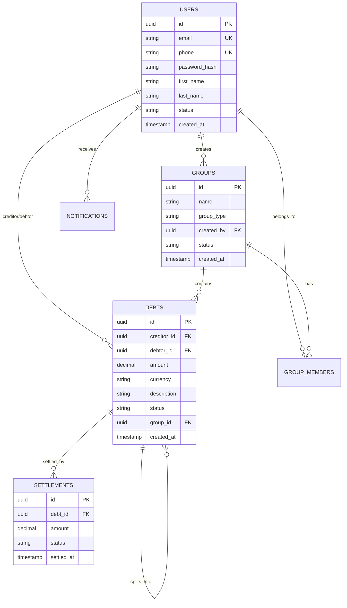

# 🗄️ Database Schema - Settler App

## Overview
The Settler app uses **PostgreSQL** as the primary database with **Redis** for caching and sessions. The schema is designed for **ACID compliance**, **scalability**, and **data integrity**.

## 🎯 Design Principles

### 1. **Normalization & Performance**
- 3NF normalized tables
- Strategic denormalization for performance
- Optimized indexes for common queries
- Composite indexes for complex searches

### 2. **Audit & Compliance**
- Soft deletes for all entities
- Created/Updated timestamps
- Audit logs for sensitive operations
- Data encryption for PII

### 3. **Scalability Considerations**
- UUID primary keys for distributed systems
- Partitioning ready design
- Efficient foreign key relationships
- Minimal circular dependencies

---

## 📋 Core Tables

### 1. **Users Table**
```sql
CREATE TABLE users (
    id UUID PRIMARY KEY DEFAULT gen_random_uuid(),
    email VARCHAR(255) UNIQUE NOT NULL,
    phone VARCHAR(20) UNIQUE,
    password_hash VARCHAR(255) NOT NULL,
    
    -- Profile Information
    first_name VARCHAR(100) NOT NULL,
    last_name VARCHAR(100) NOT NULL,
    avatar_url VARCHAR(500),
    date_of_birth DATE,
    
    -- Settings
    currency VARCHAR(3) DEFAULT 'USD',
    language VARCHAR(5) DEFAULT 'en',
    timezone VARCHAR(50) DEFAULT 'UTC',
    
    -- Security
    is_email_verified BOOLEAN DEFAULT FALSE,
    is_phone_verified BOOLEAN DEFAULT FALSE,
    two_factor_enabled BOOLEAN DEFAULT FALSE,
    two_factor_secret VARCHAR(255),
    
    -- Status
    status VARCHAR(20) DEFAULT 'active', -- active, suspended, deleted
    role VARCHAR(20) DEFAULT 'user',      -- user, premium, admin
    
    -- Metadata
    last_login_at TIMESTAMP,
    created_at TIMESTAMP DEFAULT CURRENT_TIMESTAMP,
    updated_at TIMESTAMP DEFAULT CURRENT_TIMESTAMP,
    deleted_at TIMESTAMP
);

-- Indexes
CREATE INDEX idx_users_email ON users(email);
CREATE INDEX idx_users_phone ON users(phone);
CREATE INDEX idx_users_status ON users(status) WHERE deleted_at IS NULL;
CREATE INDEX idx_users_created_at ON users(created_at);
```

### 2. **Debts Table**
```sql
CREATE TABLE debts (
    id UUID PRIMARY KEY DEFAULT gen_random_uuid(),
    
    -- Parties
    creditor_id UUID NOT NULL REFERENCES users(id),
    debtor_id UUID NOT NULL REFERENCES users(id),
    
    -- Debt Details
    amount DECIMAL(15,2) NOT NULL CHECK (amount > 0),
    currency VARCHAR(3) NOT NULL DEFAULT 'USD',
    description TEXT NOT NULL,
    category VARCHAR(50), -- food, rent, utilities, personal, etc.
    
    -- Dates
    due_date DATE,
    reminder_date DATE,
    
    -- Status & Tracking
    status VARCHAR(20) DEFAULT 'pending', -- pending, acknowledged, disputed, settled, cancelled
    settlement_type VARCHAR(20), -- full, partial
    
    -- Evidence
    proof_url VARCHAR(500), -- Receipt, contract, etc.
    notes TEXT,
    
    -- Group Association (Optional)
    group_id UUID REFERENCES groups(id),
    parent_debt_id UUID REFERENCES debts(id), -- For debt splitting
    
    -- Metadata
    created_at TIMESTAMP DEFAULT CURRENT_TIMESTAMP,
    updated_at TIMESTAMP DEFAULT CURRENT_TIMESTAMP,
    deleted_at TIMESTAMP,
    
    -- Constraints
    CONSTRAINT different_parties CHECK (creditor_id != debtor_id)
);

-- Indexes
CREATE INDEX idx_debts_creditor ON debts(creditor_id) WHERE deleted_at IS NULL;
CREATE INDEX idx_debts_debtor ON debts(debtor_id) WHERE deleted_at IS NULL;
CREATE INDEX idx_debts_status ON debts(status) WHERE deleted_at IS NULL;
CREATE INDEX idx_debts_due_date ON debts(due_date) WHERE deleted_at IS NULL;
CREATE INDEX idx_debts_group ON debts(group_id) WHERE deleted_at IS NULL;
CREATE INDEX idx_debts_amount_currency ON debts(amount, currency);
```

### 3. **Groups Table**
```sql
CREATE TABLE groups (
    id UUID PRIMARY KEY DEFAULT gen_random_uuid(),
    
    -- Group Information
    name VARCHAR(100) NOT NULL,
    description TEXT,
    group_type VARCHAR(30) NOT NULL, -- household, trip, project, business
    
    -- Settings
    currency VARCHAR(3) DEFAULT 'USD',
    auto_settle BOOLEAN DEFAULT FALSE,
    require_approval BOOLEAN DEFAULT TRUE,
    
    -- Visual
    avatar_url VARCHAR(500),
    color VARCHAR(7), -- Hex color code
    
    -- Management
    created_by UUID NOT NULL REFERENCES users(id),
    status VARCHAR(20) DEFAULT 'active', -- active, archived, deleted
    
    -- Metadata
    created_at TIMESTAMP DEFAULT CURRENT_TIMESTAMP,
    updated_at TIMESTAMP DEFAULT CURRENT_TIMESTAMP,
    deleted_at TIMESTAMP
);

-- Indexes
CREATE INDEX idx_groups_created_by ON groups(created_by) WHERE deleted_at IS NULL;
CREATE INDEX idx_groups_status ON groups(status) WHERE deleted_at IS NULL;
CREATE INDEX idx_groups_type ON groups(group_type) WHERE deleted_at IS NULL;
```

### 4. **Group Members Table**
```sql
CREATE TABLE group_members (
    id UUID PRIMARY KEY DEFAULT gen_random_uuid(),
    
    group_id UUID NOT NULL REFERENCES groups(id) ON DELETE CASCADE,
    user_id UUID NOT NULL REFERENCES users(id),
    
    -- Role & Permissions
    role VARCHAR(20) DEFAULT 'member', -- admin, member, viewer
    permissions JSONB DEFAULT '[]', -- ["can_add_expense", "can_settle", "can_invite"]
    
    -- Status
    status VARCHAR(20) DEFAULT 'active', -- active, invited, left, removed
    invite_token VARCHAR(100),
    invite_expires_at TIMESTAMP,
    
    -- Metadata
    joined_at TIMESTAMP DEFAULT CURRENT_TIMESTAMP,
    left_at TIMESTAMP,
    
    -- Constraints
    UNIQUE(group_id, user_id)
);

-- Indexes
CREATE INDEX idx_group_members_group ON group_members(group_id);
CREATE INDEX idx_group_members_user ON group_members(user_id);
CREATE INDEX idx_group_members_status ON group_members(status);
CREATE INDEX idx_group_members_invite_token ON group_members(invite_token) WHERE invite_token IS NOT NULL;
```

### 5. **Settlements Table**
```sql
CREATE TABLE settlements (
    id UUID PRIMARY KEY DEFAULT gen_random_uuid(),
    
    -- Reference
    debt_id UUID NOT NULL REFERENCES debts(id),
    
    -- Settlement Details
    amount DECIMAL(15,2) NOT NULL CHECK (amount > 0),
    currency VARCHAR(3) NOT NULL,
    settlement_method VARCHAR(30), -- cash, bank_transfer, payment_app, crypto
    
    -- Transaction Info
    transaction_id VARCHAR(100), -- External payment reference
    payment_proof_url VARCHAR(500),
    
    -- Legal Document
    receipt_url VARCHAR(500),
    digital_signature JSONB, -- Contains signature metadata
    witness_signature JSONB,
    
    -- Status & Confirmation
    status VARCHAR(20) DEFAULT 'pending', -- pending, confirmed, failed, disputed
    confirmed_by_creditor BOOLEAN DEFAULT FALSE,
    confirmed_by_debtor BOOLEAN DEFAULT FALSE,
    confirmation_code VARCHAR(10),
    
    -- Metadata
    settled_at TIMESTAMP DEFAULT CURRENT_TIMESTAMP,
    confirmed_at TIMESTAMP,
    created_at TIMESTAMP DEFAULT CURRENT_TIMESTAMP,
    updated_at TIMESTAMP DEFAULT CURRENT_TIMESTAMP
);

-- Indexes
CREATE INDEX idx_settlements_debt ON settlements(debt_id);
CREATE INDEX idx_settlements_status ON settlements(status);
CREATE INDEX idx_settlements_settled_at ON settlements(settled_at);
CREATE INDEX idx_settlements_amount ON settlements(amount, currency);
```

### 6. **Notifications Table**
```sql
CREATE TABLE notifications (
    id UUID PRIMARY KEY DEFAULT gen_random_uuid(),
    
    -- Target
    user_id UUID NOT NULL REFERENCES users(id),
    
    -- Content
    type VARCHAR(50) NOT NULL, -- debt_created, settlement_request, group_invite, etc.
    title VARCHAR(200) NOT NULL,
    message TEXT NOT NULL,
    
    -- Metadata
    data JSONB, -- Additional context data
    related_entity_type VARCHAR(50), -- debt, settlement, group
    related_entity_id UUID,
    
    -- Status
    is_read BOOLEAN DEFAULT FALSE,
    is_sent BOOLEAN DEFAULT FALSE,
    
    -- Delivery
    delivery_method VARCHAR(20) DEFAULT 'push', -- push, email, sms
    
    -- Timing
    scheduled_for TIMESTAMP,
    sent_at TIMESTAMP,
    read_at TIMESTAMP,
    created_at TIMESTAMP DEFAULT CURRENT_TIMESTAMP
);

-- Indexes
CREATE INDEX idx_notifications_user ON notifications(user_id);
CREATE INDEX idx_notifications_type ON notifications(type);
CREATE INDEX idx_notifications_unread ON notifications(user_id, is_read) WHERE is_read = FALSE;
CREATE INDEX idx_notifications_created_at ON notifications(created_at);
```

### 7. **Audit Logs Table**
```sql
CREATE TABLE audit_logs (
    id UUID PRIMARY KEY DEFAULT gen_random_uuid(),
    
    -- Actor
    user_id UUID REFERENCES users(id),
    ip_address INET,
    user_agent TEXT,
    
    -- Action
    action VARCHAR(50) NOT NULL, -- create, update, delete, settle, etc.
    entity_type VARCHAR(50) NOT NULL, -- debt, user, group, settlement
    entity_id UUID NOT NULL,
    
    -- Changes
    old_values JSONB,
    new_values JSONB,
    
    -- Context
    metadata JSONB,
    
    -- Timing
    created_at TIMESTAMP DEFAULT CURRENT_TIMESTAMP
);

-- Indexes
CREATE INDEX idx_audit_logs_user ON audit_logs(user_id);
CREATE INDEX idx_audit_logs_entity ON audit_logs(entity_type, entity_id);
CREATE INDEX idx_audit_logs_action ON audit_logs(action);
CREATE INDEX idx_audit_logs_created_at ON audit_logs(created_at);

-- Partition by month for better performance
CREATE TABLE audit_logs_y2024m01 PARTITION OF audit_logs 
    FOR VALUES FROM ('2024-01-01') TO ('2024-02-01');
```

---

## 🔗 Relationships Diagram



---

## 📊 Views & Aggregations

### 1. **User Debt Summary View**
```sql
CREATE VIEW user_debt_summary AS
SELECT 
    u.id as user_id,
    u.first_name,
    u.last_name,
    
    -- As Creditor (money owed to user)
    COALESCE(SUM(CASE WHEN d.creditor_id = u.id AND d.status = 'pending' THEN d.amount ELSE 0 END), 0) as total_owed_to_me,
    COUNT(CASE WHEN d.creditor_id = u.id AND d.status = 'pending' THEN 1 END) as debts_owed_to_me_count,
    
    -- As Debtor (money user owes)
    COALESCE(SUM(CASE WHEN d.debtor_id = u.id AND d.status = 'pending' THEN d.amount ELSE 0 END), 0) as total_i_owe,
    COUNT(CASE WHEN d.debtor_id = u.id AND d.status = 'pending' THEN 1 END) as debts_i_owe_count,
    
    -- Net balance
    COALESCE(SUM(CASE WHEN d.creditor_id = u.id AND d.status = 'pending' THEN d.amount ELSE 0 END), 0) - 
    COALESCE(SUM(CASE WHEN d.debtor_id = u.id AND d.status = 'pending' THEN d.amount ELSE 0 END), 0) as net_balance

FROM users u
LEFT JOIN debts d ON (d.creditor_id = u.id OR d.debtor_id = u.id) 
    AND d.deleted_at IS NULL
WHERE u.deleted_at IS NULL
GROUP BY u.id, u.first_name, u.last_name;
```

### 2. **Group Financial Summary View**
```sql
CREATE VIEW group_financial_summary AS
SELECT 
    g.id as group_id,
    g.name as group_name,
    
    -- Total group expenses
    COALESCE(SUM(d.amount), 0) as total_expenses,
    COUNT(d.id) as total_debts,
    
    -- Settled vs Pending
    COALESCE(SUM(CASE WHEN d.status = 'settled' THEN d.amount ELSE 0 END), 0) as settled_amount,
    COALESCE(SUM(CASE WHEN d.status = 'pending' THEN d.amount ELSE 0 END), 0) as pending_amount,
    
    -- Member count
    (SELECT COUNT(*) FROM group_members gm WHERE gm.group_id = g.id AND gm.status = 'active') as active_members,
    
    -- Last activity
    MAX(d.created_at) as last_expense_date

FROM groups g
LEFT JOIN debts d ON d.group_id = g.id AND d.deleted_at IS NULL
WHERE g.deleted_at IS NULL
GROUP BY g.id, g.name;
```

---

## 🔍 Common Queries & Optimizations

### 1. **Get User's Active Debts**
```sql
-- Optimized query with proper indexes
SELECT 
    d.*,
    CASE 
        WHEN d.creditor_id = $1 THEN 'creditor'
        ELSE 'debtor'
    END as user_role,
    CASE 
        WHEN d.creditor_id = $1 THEN debtor.first_name || ' ' || debtor.last_name
        ELSE creditor.first_name || ' ' || creditor.last_name
    END as other_party_name
FROM debts d
JOIN users creditor ON creditor.id = d.creditor_id
JOIN users debtor ON debtor.id = d.debtor_id
WHERE (d.creditor_id = $1 OR d.debtor_id = $1)
    AND d.status = 'pending'
    AND d.deleted_at IS NULL
ORDER BY d.created_at DESC;
```

### 2. **Get Group Members with Balances**
```sql
SELECT 
    u.id,
    u.first_name,
    u.last_name,
    gm.role,
    
    -- Balance within group
    COALESCE(SUM(CASE WHEN d.creditor_id = u.id THEN d.amount ELSE 0 END), 0) -
    COALESCE(SUM(CASE WHEN d.debtor_id = u.id THEN d.amount ELSE 0 END), 0) as group_balance
    
FROM group_members gm
JOIN users u ON u.id = gm.user_id
LEFT JOIN debts d ON (d.creditor_id = u.id OR d.debtor_id = u.id) 
    AND d.group_id = $1 
    AND d.status = 'pending'
    AND d.deleted_at IS NULL
WHERE gm.group_id = $1 AND gm.status = 'active'
GROUP BY u.id, u.first_name, u.last_name, gm.role;
```

---

## 🔒 Security & Encryption

### 1. **Row Level Security (RLS)**
```sql
-- Enable RLS on sensitive tables
ALTER TABLE debts ENABLE ROW LEVEL SECURITY;
ALTER TABLE settlements ENABLE ROW LEVEL SECURITY;
ALTER TABLE notifications ENABLE ROW LEVEL SECURITY;

-- Debt access policy
CREATE POLICY debt_access_policy ON debts
    FOR ALL TO authenticated_users
    USING (creditor_id = current_user_id() OR debtor_id = current_user_id());

-- Settlement access policy  
CREATE POLICY settlement_access_policy ON settlements
    FOR ALL TO authenticated_users
    USING (
        debt_id IN (
            SELECT id FROM debts 
            WHERE creditor_id = current_user_id() OR debtor_id = current_user_id()
        )
    );
```

### 2. **Data Encryption**
```sql
-- Encrypt sensitive fields
CREATE EXTENSION IF NOT EXISTS pgcrypto;

-- Function to encrypt PII
CREATE OR REPLACE FUNCTION encrypt_pii(data TEXT) 
RETURNS TEXT AS $$
BEGIN
    RETURN pgp_sym_encrypt(data, current_setting('app.encryption_key'));
END;
$$ LANGUAGE plpgsql;

-- Usage in application
INSERT INTO users (email, phone) 
VALUES (
    encrypt_pii('user@example.com'),
    encrypt_pii('+1234567890')
);
```

---

## 📈 Performance Optimizations

### 1. **Partitioning Strategy**
```sql
-- Partition audit_logs by month
CREATE TABLE audit_logs (
    -- columns...
    created_at TIMESTAMP DEFAULT CURRENT_TIMESTAMP
) PARTITION BY RANGE (created_at);

-- Create monthly partitions
CREATE TABLE audit_logs_y2024m01 PARTITION OF audit_logs 
    FOR VALUES FROM ('2024-01-01') TO ('2024-02-01');
```

### 2. **Materialized Views for Analytics**
```sql
CREATE MATERIALIZED VIEW user_statistics AS
SELECT 
    DATE_TRUNC('month', created_at) as month,
    COUNT(*) as new_users,
    COUNT(CASE WHEN status = 'active' THEN 1 END) as active_users
FROM users 
WHERE deleted_at IS NULL
GROUP BY DATE_TRUNC('month', created_at);

-- Refresh strategy
CREATE OR REPLACE FUNCTION refresh_statistics()
RETURNS void AS $$
BEGIN
    REFRESH MATERIALIZED VIEW CONCURRENTLY user_statistics;
END;
$$ LANGUAGE plpgsql;
```

---

## 🤖 AI Implementation Prompt

```
You are tasked with implementing the Settler app database schema. Use the following guidelines:

1. **Database Setup**:
   - Use PostgreSQL 15+ with UUID extension
   - Set up proper connection pooling
   - Configure read replicas for analytics
   - Implement proper backup strategy

2. **Schema Implementation**:
   - Create all tables with proper constraints
   - Add all specified indexes for performance
   - Implement foreign key relationships
   - Add check constraints for data validation

3. **Prisma ORM Integration**:
   - Generate Prisma schema from PostgreSQL
   - Create proper TypeScript types
   - Set up migrations workflow
   - Add seed data for development

4. **Security Implementation**:
   - Enable Row Level Security (RLS)
   - Implement data encryption for PII
   - Add audit logging for all operations
   - Create database roles and permissions

5. **Performance Optimization**:
   - Add proper indexes for all common queries
   - Implement query optimization
   - Set up monitoring for slow queries
   - Configure connection pooling

6. **Data Migration & Seeding**:
   - Create migration files for schema changes
   - Add comprehensive seed data
   - Implement data validation functions
   - Create backup and restore procedures

Generate production-ready database implementation that follows these specifications exactly.
``` 